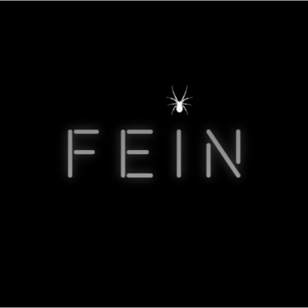

<a name="readme-top"></a>

<br/>

<div align="center">
  <a href="https://github.com/Ryen0115">
    
  </a>
  <h3 align="center">Ryen Jevs Andaya | My Portfolio</h3>
</div>

<div align="center">
  A personal showcase of my journey as an aspiring developer and IT student
</div>

<br />

---

## 📑 Table of Contents

- [Overview](#overview)
  - [Guiding Questions](#guiding-questions)
  - [Key Components](#key-components)
  - [Technology](#technology)
- [Rules, Practices and Principles](#rules-practices-and-principles)
- [Resources](#resources)

---

## 🧠 Overview

This project is a personal website portfolio built to showcase my skills, educational background, and projects as a BSIT student at FEU Tech. It includes dedicated sections for my profile, background, capabilities, and contact information.

### 🎯 Guiding Questions

- **What is this project about?**  
  A responsive multi-page personal portfolio website.

- **What is its purpose?**  
  To serve as an online identity, portfolio, and learning showcase.

- **What are its key components?**  
  Navigation, hero section, animated sections, hover effects, modular page structure.

- **What technologies are used?**  
  HTML, CSS, and minimal JavaScript for effects.

### 🧩 Key Components

- Multi-page layout:
  - About Me
  - Education
  - Skills (includes project cards)
  - Contact (clickable contact cards)
- Scroll animations and responsive design
- Modern serif typography using Playfair Display
- Personal branding with custom image and icons

### 💻 Technology


---

## 📏 Rules, Practices and Principles

1. Each folder begins with `WD-` to represent Web Dev structure.
2. Every section/page contains its own `index.html`.
3. Page folders maintain their own `assets` for CSS/images.
4. Use **camelCase** for file names.
   - Example: `projectCardImage.jpg`
5. Follow semantic HTML5 practices for better accessibility and SEO.
6. Use external CSS only—avoid inline styles.
7. Stick to a clean, serif design system for brand consistency.

```plaintext
WD-Online-Portfolio
│
├── assets
│   ├── css
│   │   └── style.css
│   └── img
├── pages
│   ├── aboutMe
│   │   └── index.html
│   ├── education
│   │   └── index.html
│   ├── skills
│   │   └── index.html
│   └── contact
│       └── index.html
├── index.html
└── README.md
